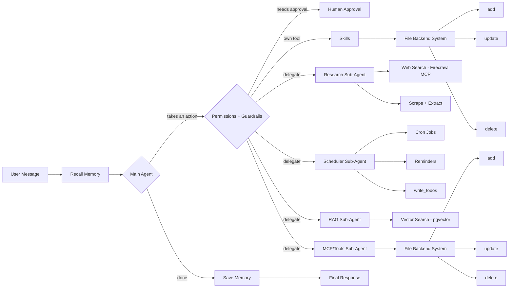

# Argus

A general-purpose AI agent inspired by Hermes, built on LangChain, LangGraph and DeepAgents.

---

## Tools and capabilities

- **Tools** — functions the agent calls to act on the world, not just answer questions.
- **MCP** — tool servers registered once in a central config; every agent inherits the full set.
- **Backend file system** — a filesystem the agents read and write, so large artifacts pass between them by path instead of through the context window.
- **Long-term memory** — facts, preferences and entities that outlive the session and are recalled when relevant.
- **Short-term memory** — thread-scoped state, checkpointed so a run survives a restart and can resume mid-task.
- **Multi-agent system** — a main agent that plans and delegates to specialist sub-agents, each with its own context and a narrow toolset.
- **Cron jobs for scheduling tasks** — deferred and recurring work that fires with no human present.
- **RAG** — retrieval over your own documents, so answers are grounded in your corpus rather than the model's recall.
- **Permissions** — per-tool policy of allow, ask or deny: retrieval flows freely, irreversible actions stop at a gate.
- **Human-in-the-loop** — an approval step before sensitive actions, where you can approve, edit the arguments, or reject with feedback.
- **Guardrails** — validation, budgets and recursion limits that constrain what flows through a tool call once it's permitted.
- **Skills** — capability bundles loaded on demand, so what the agent can do grows without the base prompt growing with it.

---

## Architecture

