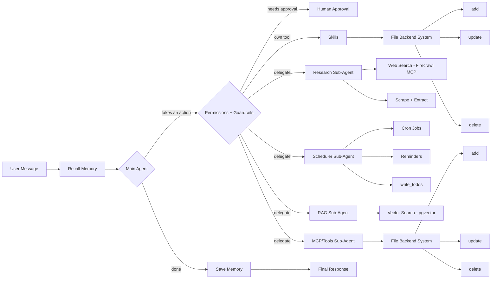

# Argus

A general-purpose AI agent inspired by Hermes, built on LangChain, LangGraph and DeepAgents.

---

## Tools and capabilities

- Tools
- MCP
- Backend file system
- Long-term memory
- Short-term memory
- Multi-agent system
- Cron jobs for scheduling tasks
- RAG
- Permissions
- Human-in-the-loop
- Guardrails
- Skills

---

## Architecture

