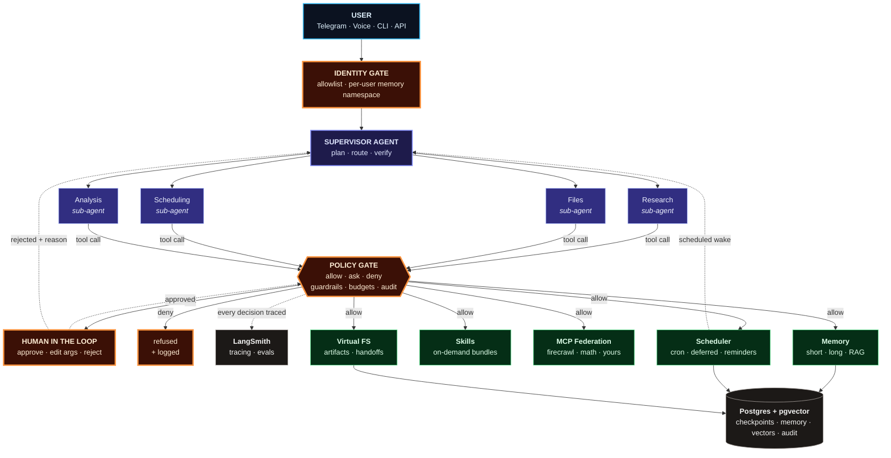
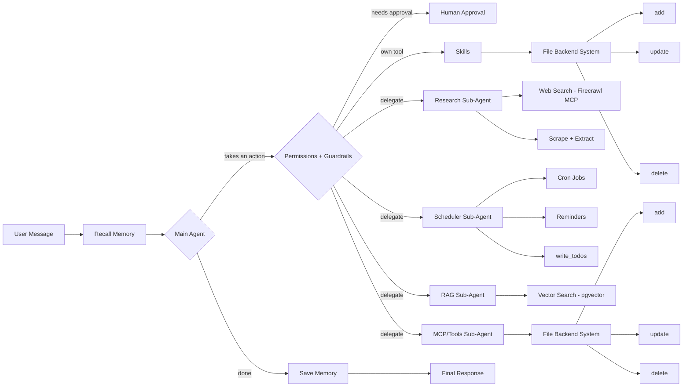
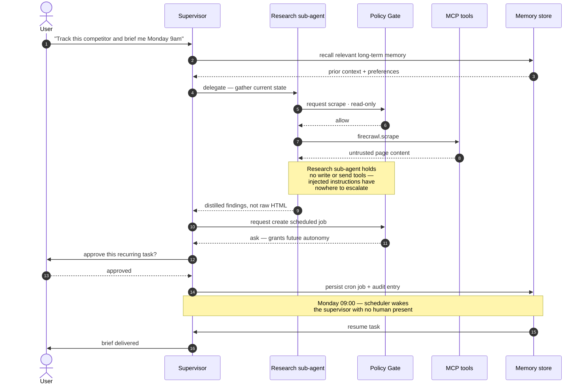

<div align="center">

# Argus

A general-purpose AI agent inspired by Hermes, built on LangChain, LangGraph and DeepAgents.

[](https://www.python.org/)
[](https://python.langchain.com/)
[](https://langchain-ai.github.io/langgraph/)
[](https://github.com/langchain-ai/deepagents)
[](https://modelcontextprotocol.io/)
[](LICENSE)

</div>

---

Argus has the tools and capabilities of:

- Tools
- MCP
- Backend file system
- Long-term memory
- Short-term memory
- Multi-agent system
- Cron jobs for scheduling tasks
- RAG
- Permissions
- Human-in-the-loop
- Guardrails
- Skills

---

## Why Argus exists

Most "AI assistants" are a chat box wrapped around a model. They forget you the moment
the tab closes, they can only do what someone hardcoded, and they ship with exactly two
trust settings: *do nothing*, or *do everything*.

Argus inverts each of those assumptions.

| Typical assistant | Argus |
| --- | --- |
| Stateless — context dies with the session | **Short- and long-term memory.** Thread state is checkpointed; durable facts and preferences are written deliberately and recalled on relevance. |
| One monolithic prompt doing everything | **A supervisor delegating to specialist sub-agents**, each with a narrow toolset and its own context window. |
| Tools hardcoded at build time | **MCP federation.** Register a server once; every agent inherits the tools. No glue code, no redeploy. |
| Only acts while you watch | **Cron-scheduled autonomy and reminders.** Argus can pick a task back up at 6am Tuesday, unattended. |
| All-or-nothing trust | **Scoped per-tool permissions, guardrails, and human-in-the-loop approvals.** Read freely, write with consent, spend money never. |
| Skills = more prompt text | **Composable skills** loaded on demand, so capability grows without prompt rot. |
| Opaque when it misbehaves | **Traced end to end.** Every hop, tool call and decision is inspectable and replayable. |

The goal is a system you could hand a real responsibility to — because you can see what
it did, constrain what it may do, and interrupt it before it does something expensive.

---

## Architecture



Reading it: every tool call a sub-agent makes passes the policy gate, and sub-agents
return conclusions to the supervisor rather than their raw transcripts. Nothing reaches a
capability layer without a decision — `allow`, `ask`, or `deny` — being made and logged.

Every box is a seam, not a hardcode. Swap the model, add an MCP server, register a new
sub-agent, or tighten a permission without touching the layers around it.

### The path of a single message

The same system zoomed in on one turn — what actually happens between a message arriving
and a reply going out.



Four things this view makes explicit:

**The gate is the only exit from the main agent.** Own tools, delegated sub-agents and
human approval all sit behind `Permissions + Guardrails`. There is no side channel where
an action reaches a capability without a policy decision being made first.

**Memory brackets the turn.** Recall runs before the model reasons, and the durable write
happens after the work completes — once, with the conclusion, rather than continuously
with the transcript.

**Skills resolve through the file backend, not the prompt.** `Skills` holds no capability
text inline; it reads and mutates skill definitions through the File Backend System
(`add` / `update` / `delete`). That's what lets the skill set grow without the base prompt
growing with it. The MCP/Tools sub-agent manages its registry the same way, which is why
adding a tool doesn't mean redeploying an agent.

**`write_todos` belongs to the scheduler.** Task planning sits alongside cron jobs and
reminders on purpose: a todo the agent writes for itself and a job it schedules for
Tuesday 9am are the same primitive with different due dates.

The source for this diagram lives in [`_h.mmd`](_h.mmd).

### What a guarded request actually looks like



---

## Capabilities

Status is marked honestly. This is an actively evolving system; roadmap items are
designed for, not yet shipped.

| Capability | What it means | Status |
| --- | --- | --- |
| **MCP federation** | One central registry; every agent inherits every tool. Firecrawl for web retrieval plus a local FastMCP server as the reference implementation. | ✅ Working |
| **Custom MCP servers** | Author tools as a FastMCP process — decorate a function, it becomes an agent-callable tool over stdio. | ✅ Working |
| **Telegram interface** | Talk to Argus from your phone. Typing indicators, per-message error isolation, async invocation. | ✅ Working |
| **Multi-agent orchestration** | A supervisor plans and delegates to specialist sub-agents with isolated context, on DeepAgents + LangGraph. | 🔧 In progress |
| **Short-term memory** | Thread-scoped state via LangGraph checkpointers — durable across restarts, resumable mid-run. | 🔧 In progress |
| **Long-term memory** | Cross-session store for facts, preferences and entities, retrieved semantically with conflict resolution on contradiction. | 🔧 In progress |
| **RAG** | Chunk, embed and retrieve over your own corpus so answers are grounded in your documents rather than the model's recall. | 🔧 In progress |
| **Skills** | Capability bundles — instructions, tools, examples — loaded only when relevant, keeping the base prompt lean. | 🔧 In progress |
| **Backend virtual file system** | A filesystem the agents read and write: scratch space, artifacts, and sub-agent handoff by path instead of by context window. | 🔧 In progress |
| **Observability** | LangSmith tracing across every delegation hop and tool call, with an eval suite guarding against regressions. | 🔧 In progress |
| **Guardrails** | Input validation, PII redaction, output filtering, token and cost budgets, recursion limits, sandboxed code execution. | 📋 Designed |
| **Permissions** | Per-tool policy — `allow`, `ask`, `deny` — so retrieval flows freely and irreversible actions stop at a gate. | 📋 Designed |
| **Human-in-the-loop** | LangGraph interrupts surface an approval before sensitive actions. Approve, edit the arguments, or reject with feedback the agent then reasons about. | 📋 Designed |
| **Audit log** | An append-only record of what was requested, what ran, what a human approved, and what it cost. | 📋 Designed |
| **Cron and deferred tasks** | "Do this Monday at 9." Argus persists the intent and executes it later with no human present. | 📋 Designed |
| **Reminders** | Time- and event-based nudges pushed back on whichever surface you're on. | 📋 Designed |
| **Identity and multi-tenancy** | Allowlist auth at the surface, memory namespaced per user. | 📋 Designed |
| **Voice** | Speech in, speech out via ElevenLabs, so the interface isn't limited to text. | 📋 Designed |

---

## The trust model

An agent with web access, filesystem writes and a scheduler is a genuinely powerful
thing. Argus assumes that power should be bounded by policy, not by hoping the prompt
holds.

### Permissions

Policy is declared per tool class, not per agent, so a capability can't be laundered by
delegating it to a different sub-agent.

| Tool class | Default | Why |
| --- | --- | --- |
| Retrieval — search, scrape, RAG query | `allow` | Reversible and cheap. Friction here buys nothing. |
| Memory write | `allow` | Append-only and fully auditable. |
| Virtual FS read | `allow` | Sandboxed to the agent workspace. |
| Virtual FS overwrite or delete | `ask` | Destructive and not always recoverable. |
| Outbound communication — send, post, email | `ask` | Irreversible and reaches third parties under your name. |
| Schedule creation | `ask` | Grants the agent future autonomy you won't be present for. |
| Code execution | sandbox only | Runs in QuickJS with no host filesystem or network. |
| Payments and billing | `deny` | There is no policy under which this should be automatic. |

### Guardrails

Distinct from permissions: permissions decide *whether* an action is allowed, guardrails
constrain *what flows through* it.

- **Tool-argument validation** against schemas before execution, so a malformed or
  coerced call fails closed rather than half-succeeding.
- **PII redaction** on the way into the model and into logs.
- **Output filtering** before anything reaches an external surface.
- **Token and cost budgets** per run and per user, with hard stops — the safeguard that
  matters most once scheduled autonomy means nobody is watching.
- **Recursion and loop limits** so a delegation cycle can't run away.
- **Sandboxed execution** via `langchain-quickjs` for any generated code.

### Threat model: untrusted content

Argus scrapes the open web and feeds the result to an agent that can write files and
schedule work. That is the textbook prompt-injection path, and it's treated as a
first-class design constraint:

1. **Capability separation is the primary defense.** The sub-agent that touches untrusted
   content holds no write, send, or schedule tools. Instructions smuggled into a scraped
   page have nowhere to escalate.
2. **Provenance tagging.** External content enters the context labelled as data, never as
   instruction.
3. **Sub-agents return conclusions, not transcripts,** so raw adversarial text never
   reaches the supervisor that does hold privileged tools.
4. **Human-in-the-loop on every irreversible action,** which is the backstop when the
   first three fail.
5. **Audit log**, because detection matters when prevention doesn't hold.

---

## Design decisions worth calling out

**A single MCP registry, not per-script tool wiring.**
Tools are declared once in `mcp_config.py`. Every entry point — Telegram, CLI, scheduled
worker — calls `get_mcp_client()` and inherits the full toolset. Adding a capability to
the entire system is a six-line dict entry.

**Sub-agents are context isolation, not org-chart cosplay.**
The reason to split agents isn't aesthetics. A research task producing 40k tokens of
scraped HTML should not pollute the reasoning context of the agent deciding what to do
next. Sub-agents return conclusions; the transcript stays behind. That this also
contains prompt injection is the useful second-order effect.

**Memory is written, not accumulated.**
Appending everything to a vector store isn't memory, it's a landfill. Argus separates
thread state — short-term, automatic, checkpointed — from durable knowledge, which is
written deliberately, so recall stays precise as history grows rather than degrading.

**The file system is the handoff medium.**
Passing large artifacts between agents through message history is expensive and lossy.
Writing to a virtual FS and passing a path is neither.

**Traces are not optional at this depth.**
Debugging why a sub-agent three hops down chose the wrong tool is impossible from a
final answer alone. Tracing is a structural requirement of multi-agent design, not
tooling polish.

---

## Data and persistence

One store, four jobs — chosen so that adding memory doesn't mean adding four services:

| Concern | Backing |
| --- | --- |
| Short-term thread state | LangGraph Postgres checkpointer |
| Long-term memory | Postgres table + pgvector for semantic recall |
| RAG index | pgvector, chunked via `langchain-text-splitters` |
| Cron jobs, reminders, audit log | Postgres tables |

SQLite is a drop-in for local development.

---

## Getting started

### Prerequisites

- Python 3.13+
- [`uv`](https://docs.astral.sh/uv/) (recommended) or pip
- Node.js — required for npx-based MCP servers such as Firecrawl
- An OpenAI API key, a Firecrawl API key, and a Telegram bot token

### Install

```bash
git clone https://github.com/siwaht/Argus.git
cd Argus

uv sync                      # or: pip install -r requirements.txt
```

### Configure

Create a `.env` in the project root:

```env
OPENAI_API_KEY=sk-...
FIRECRAWL_API_KEY=fc-...
TELEGRAM_BOT_TOKEN=123456:ABC-...

# optional — tracing
LANGSMITH_API_KEY=ls-...
LANGSMITH_TRACING=true
```

`.env` is gitignored. Keep it that way.

### Run

```bash
python main.py
```

Message your bot on Telegram. It spins up the agent with every registered MCP tool
available and replies in-thread.

---

## Project structure

```
argus/
├── main.py           # Telegram entry point — async agent invocation per message
├── agent.py          # Agent construction: supervisor, sub-agents, memory, skills
├── mcp_config.py     # Central MCP server registry + get_mcp_client()
├── math_server.py    # Reference FastMCP server — the pattern for your own tools
├── pyproject.toml    # Dependencies (uv / PEP 621)
└── .env              # Secrets — never committed
```

---

## Extending Argus

### Add an MCP server

One entry in `MCP_SERVERS` in `mcp_config.py`:

```python
"github": {
    "command": "npx",
    "args": ["-y", "@modelcontextprotocol/server-github"],
    "transport": "stdio",
    "env": {"GITHUB_TOKEN": os.environ["GITHUB_TOKEN"]},
},
```

Every agent in the system now has GitHub tools. No other file changes.

### Write your own tool

Follow `math_server.py`. A decorated function is a tool, and the docstring is the
interface the model reads:

```python
from fastmcp import FastMCP

mcp = FastMCP("Calendar")

@mcp.tool()
def create_event(title: str, iso_start: str, duration_minutes: int) -> str:
    """Create a calendar event and return its ID."""
    ...

if __name__ == "__main__":
    mcp.run(transport="stdio")
```

Register it as a local `python` stdio server and it's live.

---

## Deployment

The scheduler cannot live inside the bot's polling loop — deferred tasks must survive a
restart of the chat surface. Argus runs as two processes against shared Postgres:

```
┌────────────────┐        ┌──────────────────┐
│  argus-web     │        │  argus-worker    │
│  chat surfaces │        │  cron · deferred │
│  live requests │        │  tasks · retries │
└───────┬────────┘        └────────┬─────────┘
        └──────────┬───────────────┘
                   ▼
        Postgres + pgvector
   checkpoints · memory · jobs · audit
```

Both ship from one image with different entrypoints.

---

## Troubleshooting

| Symptom | Fix |
| --- | --- |
| `npx` not found on Windows | Install Node.js and reopen the terminal so `PATH` refreshes. PowerShell caches it. |
| MCP server exits immediately | Run the server command by hand first. stdio transport swallows startup errors. |
| `KeyError` on an env var at import | `mcp_config.py` reads `os.environ` eagerly — a missing key fails at import, not at call time. Check `.env` is present in the project root. |
| Slow first response | npx-based servers download on first launch. Subsequent starts are cached. |
| Python 3.13 wheel build failures | Use `uv sync` rather than pip; it resolves prebuilt wheels far more reliably here. |

---

## Tech stack

| Layer | Choice |
| --- | --- |
| Agent framework | LangChain 1.x |
| Orchestration and state | LangGraph 1.x |
| Multi-agent patterns | DeepAgents |
| Tool protocol | MCP via `langchain-mcp-adapters` |
| Tool authoring | FastMCP |
| Model | OpenAI `gpt-4o-mini` by default, swappable |
| Retrieval | `langchain-text-splitters` + pgvector |
| Sandboxed execution | `langchain-quickjs` |
| Voice | ElevenLabs |
| Chat surface | pyTelegramBotAPI |
| Observability | LangSmith |

---

## Roadmap

- [x] MCP federation with a central registry
- [x] Custom FastMCP tool servers
- [x] Telegram interface
- [ ] Supervisor + sub-agent topology on DeepAgents
- [ ] Checkpointed short-term memory and long-term store
- [ ] RAG over user-supplied corpora
- [ ] Skill registry with on-demand loading
- [ ] Virtual backend file system
- [ ] LangSmith tracing and eval suite
- [ ] Per-tool permission policy, guardrails and audit log
- [ ] Human-in-the-loop approval interrupts
- [ ] Cron scheduler, deferred tasks and reminders
- [ ] Identity gate and per-user memory namespacing
- [ ] Voice in / voice out
- [ ] Additional surfaces: web UI, CLI, HTTP API

---

## About

I built Argus because I wanted to know what it actually takes to give an agent real
responsibility — persistent memory, tools it can extend itself with, the authority to act
while nobody is watching — and to do it in a way I'd still be comfortable with at 3am on
a Sunday. Most of the interesting work turned out to be in the constraints, not the
capabilities.

Feedback, issues and ideas are welcome.

## License

MIT — see [LICENSE](LICENSE).

---

<div align="center">

*Argus Panoptes kept a hundred eyes, and never closed them all at once.*

</div>
